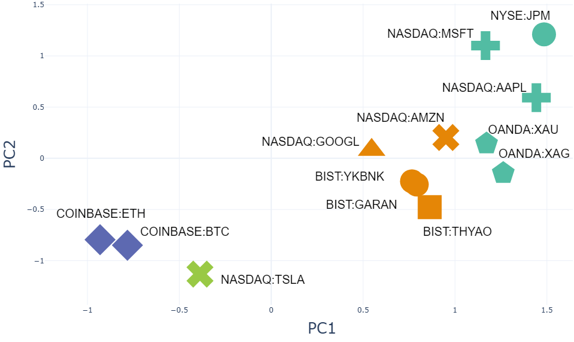
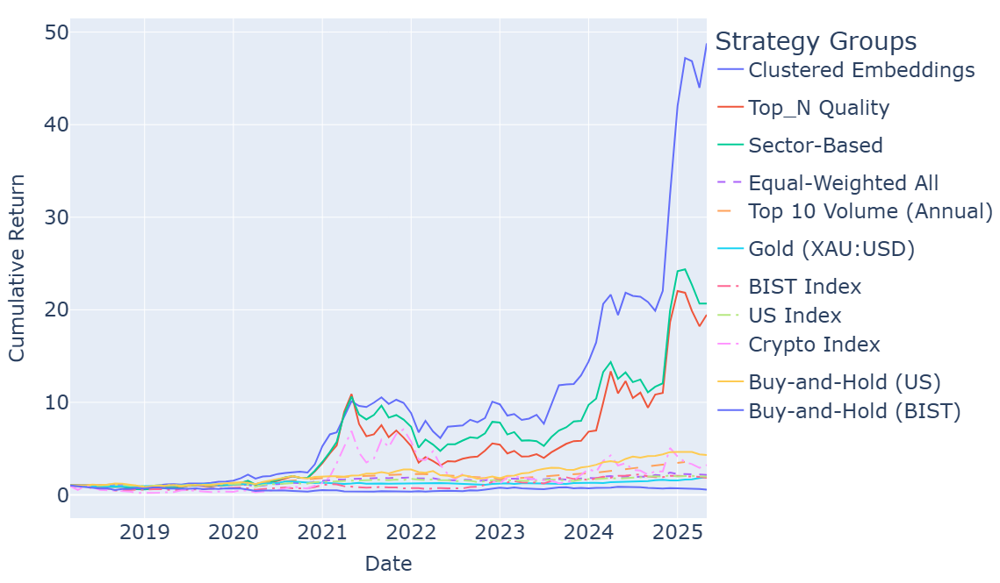
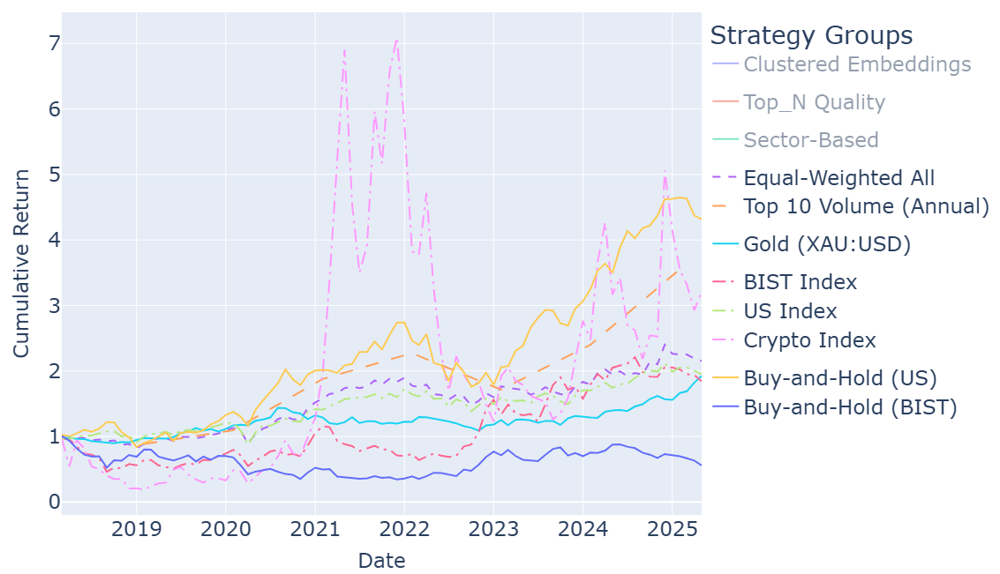

# Embedding-Based Portfolio Optimization

This project explores intelligent portfolio construction using stock return embeddings, clustering, and financial factor scoring. Developed as part of my graduation thesis at Istanbul Technical University (2025).

---

## 📊 Overview

We build globally diversified portfolios by:
- Learning return-based stock embeddings
- Clustering similar assets via KMeans
- Scoring stocks with a composite factor: momentum, volatility, and liquidity
- Tuning strategy parameters using Optuna

Backtesting is performed from 2018 to 2025 over 1,093 USD-aligned global assets including equities, commodities, and crypto.

---

## 🧠 Poster Visuals

### Embedding Space

### Cumulative Returns

### Benchmark Comparison

---

## 📁 Structure (Coming Soon)

- `embedding_model/`: Return-based temporal embedding implementation
- `portfolio_backtest/`: Monthly backtesting logic
- `optuna_tuning/`: Hyperparameter search framework
- `data/`: Preprocessed CSVs for returns, volume, sectors
- `results/`: Saved portfolios, Optuna studies, metrics

---

## 🔗 Reference

> Dolphin et al. (2023), [Stock Embeddings](https://www.mdpi.com/2673-4591/39/1/30)

---

## 📜 License

This project is for academic and non-commercial use only.
